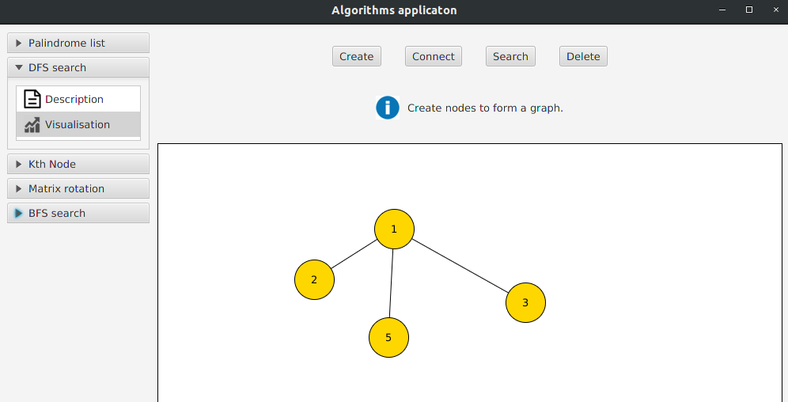

# Algorithms visualitation application

The goal of this project was to develop a simple desktop application in order to visualise
various algorithms, in order to grasp a better understanding of them and their associated data structures.

## Implementation

The application is a maven project developed in java 10.
The main idea behind the application, was developing it in such a way, that by simply adding another
algorithm implementation to the classpath, the algorithm will be added to the application's interface, 
given that a valid implementation was provided.



### Tehnologies used:

- Java 10
- Java FX library
- Maven
- Junit 5
- Light DI (dependency injection framework written by me: https://github.com/Slidem/light-di)

## Running the application

In order to run the application, make sure you have a jdk version 10 (or above) installed and compatible maven version for jdk 10. 

You also must have installed in your local dev environment the Light DI dependency injection framework. (See Tehnologies used section)

To run the application, use the following maven command:

```
mvn exec:java
```


## Algorithms

Currently, the following algorithms were implemented (more to come):
- DFS search
- BFS search
- Matrix rotation (in place)
- Find the Kth node in a linked list
- Check if a linked list is a palindrome

### DFS Search

The DFS search visualisation shows how nodes in a graph are searched in depth. You can select where you want to search for a path between node A and node B. Blue colored nodes represent nodes that are being visited.
Red colored nodes represents the path found. 


### BFS Search

The BFS search visualisation is similar to the DFS search, only that of course, it searches the nodes in the graph in breath. BFS search should always find the shortest path


### Matrix rotation (in place)

The matrix rotation visualisation shows how a matrix of n by n, can be rotated in place (not using additional space) by swapping matrix cells one by one. Red matrix cell represents the cell being swapped.


### Find the Kth node in a linked list

This visualisation shows how you can find the kth node in a singly linked list in O(N + K) time complexity. The algorithm shows how you can recursivly go until the end of the list (no valid nodes left) and count the kth node when you come back from the recursive stack.

- The blue nodes represents nodes visited on the recursive call.
- Red nodes represents nodes visited when comming back from the recursive call and the count for the kth node started.
- Green node represents the kth node.


### Check if a linked list is a palindrome

The visualisation shows how you can check if a linked list is a palindrome by choosing two runner pointers. One runner pointer increments by one, the other one always doubles in size. Once the runner that doubles in size reaches the end of the list, the normal runner should be at the half length of the list. You always keep a stack with the elements visited by the first runner. When you know you reached the half of the list with the first runner, you keep going until the end with it, and comparing the elements at the current index with the element poped from the stack.


